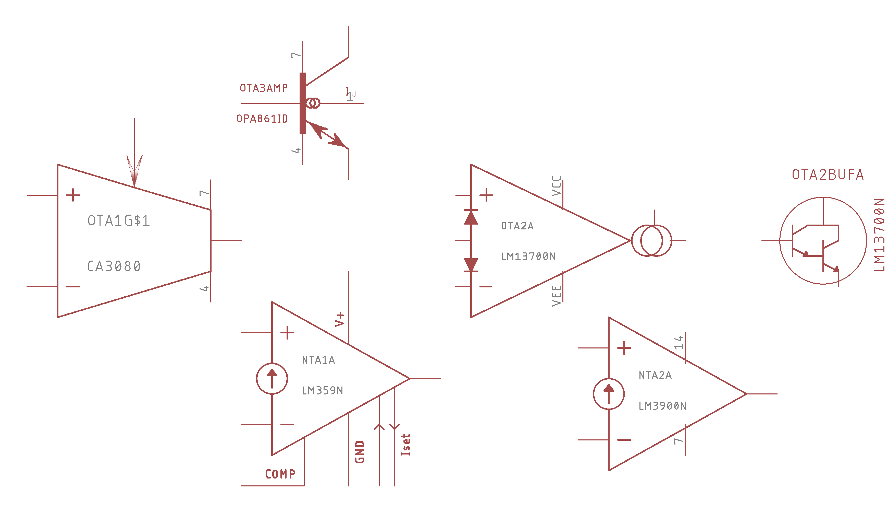

# EAGLE-OTA
<h2>Operational transconductance amplifiers (OTAs) and Norton amplifiers (NTAs)</h2>
This library contains symbols and footprints for the currently available OTAs and NTAs, as well as historical parts. 
<h3>Symbol types</h3>
<ul>
<li>Differential input OTA, without linearizing diodes <small>(CA3080)</small></li>
<li>Differentiual input OTA with linearizing diodes <small>(LM13x00, NJM13x00, NE5517)</small></li>
<li>Idealized bi-directional transistor OTA <small>(OPA861)</small></li>
  <li>Basic Norton amplifier <small>(LM2900/LM3900)</small></li>
  <li>Compensated, ultrafast programmable Norton amplifier <small>LM359</small></li>
</ul>
<h3>Footprints</h3>
<ul>
<li>DIP8</li>
  <li>DIP14</li>
<li>DIP16</li>
<li>SOIC-8/SO8</li>
  <li>SOIC-14/SO14</li>
<li>SOIC-16/SO16</li>
<li>SOT23-6</li>
</ul>
<h3>Devices</h3>
<ul>
<li>LM13600</li>
<li>LM13700</li>
<li>NJM13700</li>
<li>NJM13600</li>
<li>NE5517</li>
<li>OPA861</li>
  <li>LM2900</li>
  <li>LM3900</li>
  <li>LM359</li>
</ul>
<h3>Symbol examples</h3>

<h4>The author</h4>
This EAGLE library was developed by <b>David H. Christensen</b>.  
<a href="http://ee.david.promo">My web site</a> - <a href="http://github.com/dhkris">My GitHub</a>  
 
<small>Copyright © David H. Christensen, 2017.</small>

